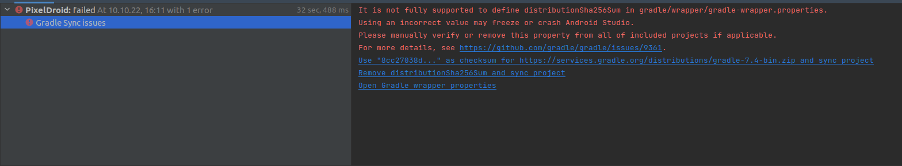
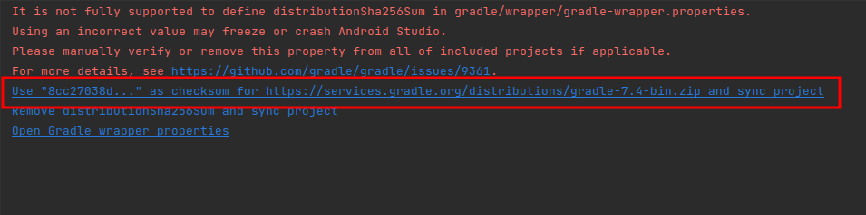
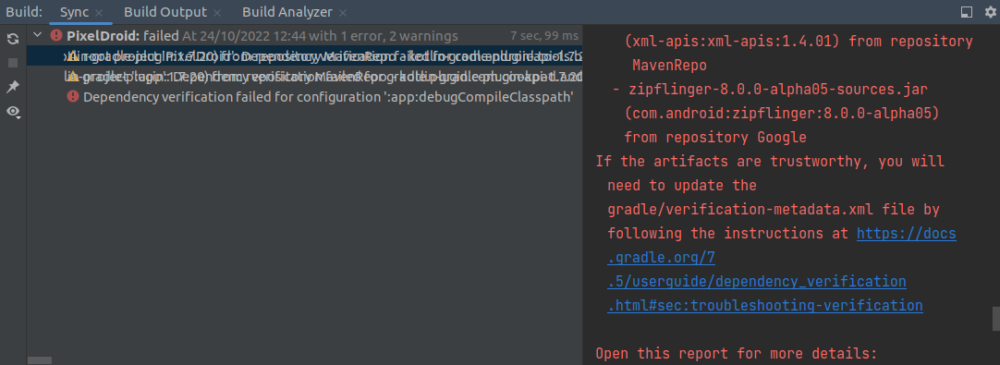
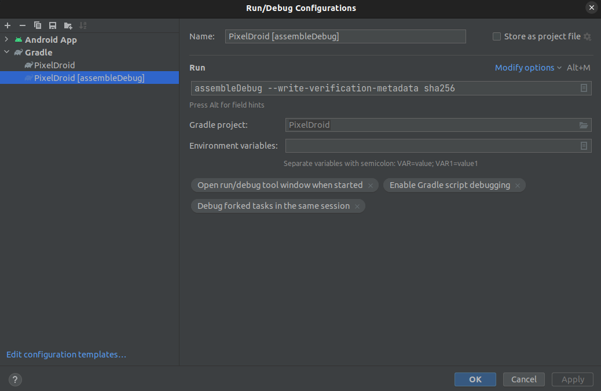
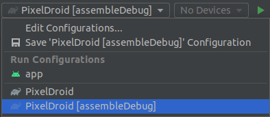

If you want to contribute to PixelDroid, you can do so in several ways:

# Translation

You can help to translate PixelDroid to your favourite language. Please do not submit Merge Requests directly, but use our weblate at https://weblate.pixeldroid.org/projects/pixeldroid/pixeldroid/ .

You can add a new language by using the "Start new translation" button on the bottom left of the page.

Before translating, please take a look at the [TRANSLATION.md](TRANSLATION.md) file for details and some guidance.

# Creating issues on the issue tracker

If you encounter a problem or have an idea about how to make PixelDroid better, you should make an issue about it on our [GitLab project](https://gitlab.shinice.net/pixeldroid/PixelDroid/-/issues). If you encountered a problem, please make sure to document how to reproduce it, and include screenshots if possible. If you are making a suggestion, please try to be detailed in your description.

# Contribute changes or fix bugs

You can also help us solve one of the existing issues, or improve the application in some other way, by contributing changes yourself. To do this you can fork the project and submit a Merge Request.

Before starting to work on an issue or an improvement, you can ask us on our Matrix channel (#pixeldroid:gnugen.ch) what we think, or make a comment on the relevant issue, so that we might point you in the right direction, and to make sure someone else is not already working on it.

## How to get started

Download the latest version of [Android Studio](https://developer.android.com/studio)

TODO: explain cloning git submodules

When first opening the project, you might encounter this issue: 

F-Droid requires ``distributionSha256Sum``. You are given three links to solve this issue, choose the first one:

### Changing Gradle dependencies

Every time you change any dependency in ``build.gradle``, you will encounter the following error:

TODO: explain why

In the top toolbar, go to ``Edit Configurations... > Gradle `` and click on ``+`` in the top left corner to add a new run configuration. In the field ``Run``, write the command that triggered the dependency error, which in your case is probably ``assembleDebug`` (command executed when pressing the play button) and give it the arguments ``--write-verification-metadata sha256``.

You can now run PixelDroid with your new configuration

This has to be done only once when you encounter this error, then you can run the app as usual again.
TODO: explain what it did